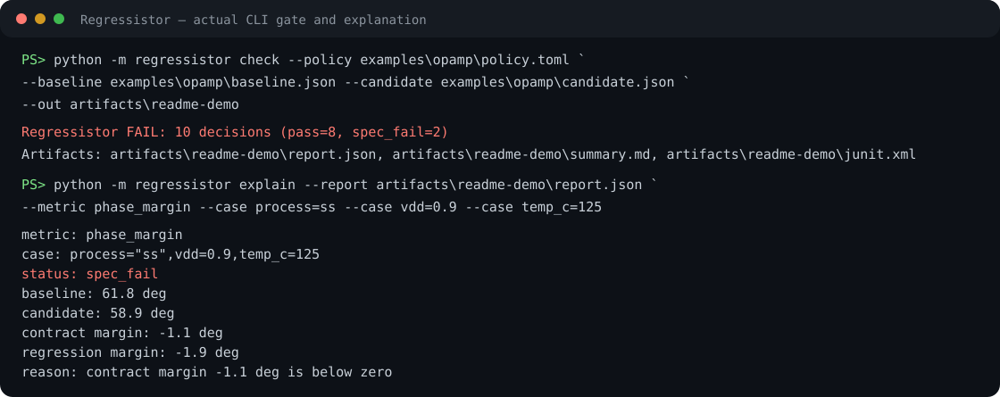

# Regressistor

[](https://github.com/appleweiping/Regressistor/actions/workflows/ci.yml)
[](https://github.com/appleweiping/Regressistor/actions/workflows/codeql.yml)
[](https://www.python.org/)
[](LICENSE)

Regressistor is a dependency-free Python 3.11+ command-line tool for analog
specification regression gates. It compares a candidate measurement bundle
against both contractual limits and a frozen, hash-addressed baseline across explicit process,
voltage, temperature, load, or user-defined case keys.

It does not run a simulator, execute policy expressions, infer missing units,
or silently accept a new baseline. This narrow boundary makes results suitable
for local review and CI.

## Install

```bash
python -m pip install .
regressistor --version
```

For development:

```bash
python -m pip install -e ".[dev]"
```

The runtime has no third-party dependencies.

## Run the example

```bash
regressistor validate \
  --policy examples/opamp/policy.toml \
  --bundle examples/opamp/baseline.json \
  --bundle examples/opamp/candidate.json

regressistor check \
  --policy examples/opamp/policy.toml \
  --baseline examples/opamp/baseline.json \
  --candidate examples/opamp/candidate.json \
  --out artifacts/opamp
```

The synthetic candidate deliberately fails phase margin at the slow,
low-voltage, high-temperature case. The command therefore exits with 1 while
still writing all three report formats.

```bash
regressistor explain \
  --report artifacts/opamp/report.json \
  --metric phase_margin \
  --case process=ss \
  --case vdd=0.9 \
  --case temp_c=125
```



## Policy format

Policies are TOML with a fixed schema version:

```toml
schema_version = 1
case_keys = ["process", "vdd", "temp_c"]

[[metrics]]
name = "phase_margin"
unit = "deg"
reduce = "min"
severity = "error"
contract = { kind = "min", limit = 60.0 }
regression = { direction = "higher", absolute_budget = 1.0 }
```

Contract kinds are `min`, `max`, `range`, and `target`. Regression directions
are `higher`, `lower`, and `target`. An adverse regression is allowed when it
is no greater than:

```text
absolute_budget + relative_budget * max(abs(baseline), relative_floor)
```

Repeated points with the same case must have distinct `sample` values. Their
measurements are reduced with `min`, `max`, `mean`, `median`, `p05`, or `p95`
before comparison.

Audit case and metric coverage before a gate with:

```bash
regressistor inspect \
  --policy policy.toml \
  --bundle candidate.json \
  --format text
```

The JSON format also lists observed units, missing case counts, unique case-key
values, and measurements that have no configured policy.

Missing cases and metrics are configured independently for baseline and
candidate using `error`, `warning`, or `ignore`.

## Bundle format

Bundles are strict JSON:

```json
{
  "schema_version": 1,
  "run": {"id": "run-42"},
  "points": [
    {
      "case": {"process": "tt", "vdd": 1.0, "temp_c": 27},
      "sample": 0,
      "metrics": {
        "phase_margin": {"value": 64.2, "unit": "deg"}
      }
    }
  ]
}
```

Values must be finite. Supported scalar units include dimensionless values,
percent, V, A, s, Hz, F, H, W, Ohm, degrees, radians, dB, SI prefixes, and one
level of multiplication or division such as `V/us` and `A/V`.

## Baseline workflow

After review, make a canonical baseline explicitly:

```bash
regressistor freeze \
  --policy policy.toml \
  --candidate accepted.json \
  --out baseline.json
```

The command refuses to overwrite an existing file unless `--force` is passed.
It records the input SHA-256 in baseline metadata.

## Outputs and exit codes

`check` writes:

- `report.json`: complete machine-readable evidence and input hashes.
- `summary.md`: deterministic reviewer summary.
- `junit.xml`: one test case per metric/corner decision.

Exit codes are 0 for a passing gate, 1 for a blocking decision, 2 for invalid
input, and 3 for output or I/O failure. Warning-severity contract failures are
reported but do not change a passing exit code.

## Python API

```python
from regressistor import compare, load_bundle, load_policy

report = compare(
    load_policy("policy.toml"),
    load_bundle("baseline.json"),
    load_bundle("candidate.json"),
)
print(report.passed, report.counts)
report.write_json("report.json")
```

## Design guarantees

- No evaluation of input text as code.
- Exact case matching after projection onto declared case keys.
- Explicit dimensional conversion; incompatible units fail visibly.
- Improvement cannot be classified as an adverse regression.
- Stable ordering and serialization for identical inputs.
- Input objects are never mutated.

See [the architecture document](docs/architecture.md) for the decision model.

## Development

```bash
ruff check .
ruff format --check .
pytest --cov=regressistor --cov-report=term-missing
python -m build
```

The project is available under the MIT License.
